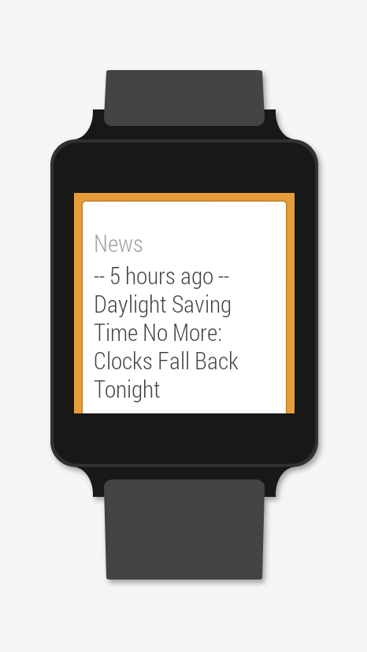
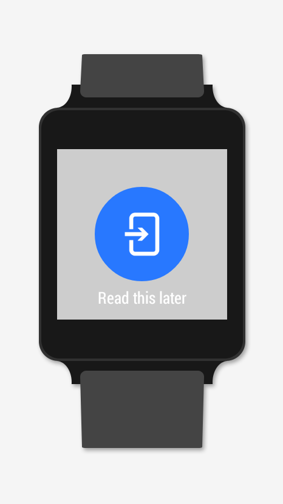
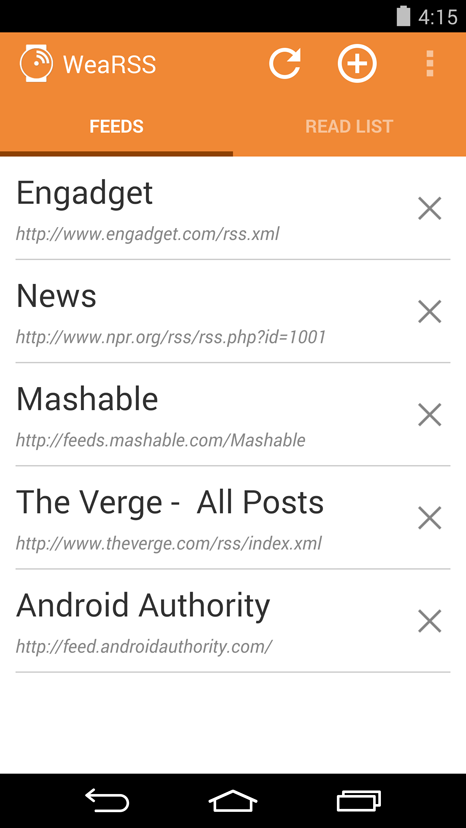
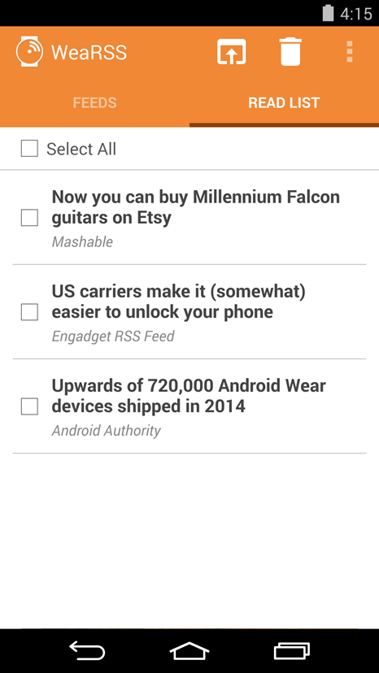

# WeaRSS

Your RSS News Feeds on Android Wear! Get news headlines pushed right to your wrist. Send to your phone to read later.

## Some of the Cool Features:

- Follow any number of RSS/Atom feeds.
- Headlines and a brief description will get sent to your device - you'll see the most recent headlines first.
- Choose how frequently headlines get synced.
- Choose how many headlines from each feed will be sent with each update.
- Send articles to from your wearable to the "Read List" for reading the full article later.
- Share to a specific app: send articles from the Read List to a specific app of your choosing like Pocket or Instapaper!
- Skip the read list entirely: select your app and share articles to it right from your wearable!






## Download

You can get the latest version on <a href="https://play.google.com/store/apps/details?id=com.creativedrewy.wearss" target="_blank">Google Play</a>.

## Building

1. Make sure you have Java 8 installed (for [gradle-retrolambda](https://github.com/evant/gradle-retrolambda) support).
2. Clone this Repo.
3. In the same parent directory where you cloned WeaRSS, clone my fork of [Riasel](https://github.com/creativedrewy/Riasel). See the example directory listing just below.
4. Open the build.gradle for WeaRSS in Android Studio.
5. Have fun!

```
:: A directory listing in the parent directory ::

WeaRSS/ - Git created this directory on clone; all repo files in here
Riasel/ - Same for Riasel
```

## Contributing

There's lots of potential features to implement, and I'd love the community's help! I'll continue to deploy WeaRSS releases to the Play Store based on features implemented from and merged into this repo. If you do fork and a make a pull request, definitely let me know how you would like credit for your work. I want to make sure people's contributions are recognized here and/or in the app.

If you'd like ideas for what could be implemented, check out the [issues](https://github.com/creativedrewy/WeaRSS/issues). Some enhancement ideas are documented there. Please comment on the relevant issue if you decide to start working on it. Also please try and follow the app's coding conventions. Unit tests aren't necessary for PRs to be accepted. Thanks!

License
--------

    Copyright 2015 Andrew Watson

    Licensed under the Apache License, Version 2.0 (the "License");
    you may not use this file except in compliance with the License.
    You may obtain a copy of the License at

       http://www.apache.org/licenses/LICENSE-2.0

    Unless required by applicable law or agreed to in writing, software
    distributed under the License is distributed on an "AS IS" BASIS,
    WITHOUT WARRANTIES OR CONDITIONS OF ANY KIND, either express or implied.
    See the License for the specific language governing permissions and
    limitations under the License.